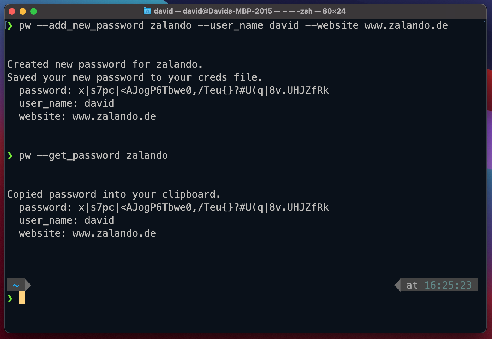

# Get passwords into your clipboard from the terminal.



### Features: 

You can run the script `pw_command.py` to manage your passwords in the command line. See the explanation
for the commands below. Here is what this tool can do:

- Copy passwords from a json file into clipboard
- Generate a random password with a length of 42 characters 
- save it to the json file as a new password with a username and a website

### Commands:

- `pw <entity>` -> Get the password of `<entity>` from the section main
- `pw -as` -> Print all sections
- `pw -s <section>` -> Print all available entities of `<section>`
- `pw -s <section> <entity>` -> Get the password of `<entity>` from `<section>`
- `pw -r` -> Generate a random password with 42 characters, print it and copy it to the clipboard
- `pw -n <name>` -> Add a new randomly created password to the creds.json file for the entity `<name>`  
- `pw -n <entity> -w <website> -u <username>` -> Create a new password with information on the website and the username
- `pw -rm <entity>` -> Remove the password for `<entity>` from the section main
- `pw -rm <entity> -s <section>` -> Remove the password for `<entity>` from `<section>`


### Store your passwords in a json file:

```
"section": {
        "key": {
            "password": "lorem",
            "username": "ipsum",
            "website": "www.website.swiss"
            "additional_info": "..."
        }
    },
"main": {
        "GitHub": {
            "password": "lorem",
            "username": "ipsum",
            "website": "www.GitHub.com"
            "additional_info": "..."
        },
        "netlify": {
            "password": "lorem",
            "username": "ipsum",
            "website": "www.netlify.com"
            "additional_info": "..."
        }
        , ...
    }
```


### How I set it up:

I create a symlink to the python script `pw_command.py` (command 2). The name of this symlink is just "pw".
The symlink needs execution permissions (command 3). The symlink needs to be in a folder that is listed
in the PATH. In my case, that's the folder `.bin` which exists in my home directory.

1. `mkdir ~/.bin/ && cd ~/.bin/`
2. `ln -s ~/dev/python_pw_cli/src/pw_command.py pw`
3. `chmod +x pw`

Furthermore, you need to assure two things:

1. Update line 1 of `pw_command.py` by specifying your path to Python3 (find out with `which python3`)
2. Create a passwords.json somewhere and pass the path to the variables in `pw_config.py` accordingly

### Todo:

- Encrypt / Decrypt creds file
- Copy username into clipboard
- Check what additional information is available on the service
- Find a better name for "entity"
- Remove a password
- Updating a password is possible, but it's not yet explained anywhere. Creating a new password will 
  update an existing password, if the key exists already.
- Main has become a huge function with a lot of if statements. How can I refactor main() 
  to be less complex and easier to read?
- Tab auto completion. How can I read available keys so that I could autocomplete them?
- Expose functionalities with an API so that I can access my passwords from my mobile phone
